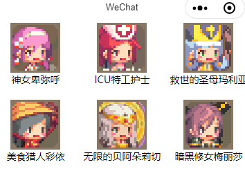

# 微信小程序学习第一天


## 课程介绍

> 前几期学生都期望微信小程序的课程放在React前面，而且小程序的工作还真的挺多的。

那么微信小程序在前端开发中的地位几何？

1. 前端开发

   1. pc端
      1. 后台管理系统（学生最多的就业方向）
      2. 官网
   2. 移动端
      1. app （份额最大）
      2. 移动端浏览器H5
      3. 微信小程序
2. 总课程十天，两天基础，后面7天用mpvue完成两个项目, 最后一天uni-app
   1. mpvue优购商城
   2. uni-app优购商城
   3. 中间穿插讲解git使用，企业开发流程，前端性能优化，Fiddler介绍，HTTP缓存等。


## Git项目克隆

微信小程序课程地址： https://github.com/jovenwang1212/learnmp  分支：mp40

问题：如何克隆项目到本地，需要先git init吗？


git克隆支持两种协议，https和ssh

1. https需要输入用户名和密码
2. ssh协议设置一次ssh key后，后续克隆提交都无须验证。工作中一般用后者。


#### 项目克隆流程

1. 用命令行工具，生成 SSH key

   1. SSH key是唯一标识电脑，和远程仓库通信的通行证

   ```bash
   # 生成ssh key,引号内邮箱随意，但最好是有意义的邮箱
   # 一路回车，如果已经生成过，提示"overwrite"，可以选择n
   ssh-keygen -t rsa -C "your_email@example.com"
   # 去到用户目录下的.ssh目录下
   cd ~/.ssh
   # 查看id_rsa.pub文件，copy所有
   cat id_rsa.pub
   ```

2. 添加SSH key

   1. github头像->settings-> SSH and GPG keys-> new SSH key
   2. 添加SSH key

3. 执行git clone, 并切换分支git checkout

4. 课程资料简介

   

#### 注意：

1. 命令行工具有很多，不建议用Power Shell，用git Bash
2. 由于项目文件太多，网速等原因，git clone可能真的会很慢。可以直接下载。
3. 一般公司会把gitlab网站的代码部署到公司的服务器上，那么托管代码就是私有的。
4. 建议学习阶段多用git命令，图形化工具sourcetree，乌龟git

> git bash里面粘贴，右键
>
> ~是指home目录


## 基本介绍

1. 基本概念（是什么）

   1. 运行在微信中
   2. 迷你的App
2. 使用

   1. 只要有微信就可以运行
3. 有什么用

   1. 目前很多公司都把小程序作为推广的渠道
   2. 工具类
   3. 电商购物
   4. 。。。
4. 众多小程序中，微信小程序最有名
   1. 支付宝小程序，头条小程序，百度智能小程序


##  如何开发微信小程序

[传送门](https://mp.weixin.qq.com/cgi-bin/wx)

> 微信小程序的代码需要发布到微信服务器上

开发微信小程序的步骤

1. [注册](<https://mp.weixin.qq.com/wxopen/waregister?action=step1>) 
2. 小程序信息完善
3. 开发
   1. [开发文档](https://developers.weixin.qq.com/miniprogram/dev/framework/)
   2. [开发者工具](https://developers.weixin.qq.com/miniprogram/dev/devtools/devtools.html)
4. 发布上线


## 注册账号&小程序信息完善-练习

[微信公众平台](https://mp.weixin.qq.com/)

#### 正常流程

2. 填写邮箱、密码，注册
   1. 邮箱不能是已经其他微信公众平台注册过的，比如注册过服务号，订阅号的
   2. 也不能是微信绑定过的。解绑方式：微信->我的->设置->帐号与安全->更多安全设置->邮件地址->解绑
3. 邮箱激活
   1. 邮箱里面点链接，跳转
4. 扫码，拿自己微信去扫码
   1. 微信账号就是小程序的管理员
5. 信息登记，包括姓名身份证等
   1. 主体类型选个人。其他需要上传认证资料的。
6. 填写小程序信息
   1. 小程序名称好名字都被取了。学习的时候，可以取一些生僻的名字
      1. 特殊的名字需要上传认证，比如“商城”
   2. 小程序头像选择积极向上的
   3. **服务类目最好选工具->信息查询，比较容易上线**

#### 注意点

1. 邮箱已经注册过公众号和订阅号，是不能用来注册小程序
2. 邮箱绑定了微信，可以解绑。解绑方式：微信->我的->设置->帐号与安全->更多安全设置->邮件地址->解绑
3. 小程序的名字，好的名字已经取不到了。
4. 小程序头像需要选一些健康，内容积极向上的图片


## 微信开发者工具安装及使用-练习

[微信开发者工具](https://developers.weixin.qq.com/miniprogram/dev/devtools/devtools.html)

1. 安装
   1. 安装稳定版本的
   2. 保留.exe文件。微信开发者工具可能会崩，需要重装
2. 新建项目
   1. 登录的微信号需要是该 AppID 的开发者；
   2. 需要一个小程序的 [AppID](https://developers.weixin.qq.com/miniprogram/dev/framework/quickstart/getstart.html#申请帐号)；如没有 AppID，可以选择申请使用[测试号](https://developers.weixin.qq.com/miniprogram/dev/devtools/sandbox.html)。
   3. 创建helloworld项目，可以看到模拟器显示文案Hello World
3. 界面拖动，拖最左边的部分
4. 点预览出现二维码，手机扫码看运行效果


## 认识微信开发者工具

[传送门](https://developers.weixin.qq.com/miniprogram/dev/devtools/page.html#%E5%90%AF%E5%8A%A8%E9%A1%B5)

**微信开发者工具是内嵌了一下chrome内核**


开发者工具主界面，从上到下，从左到右，分别为：菜单栏、工具栏、模拟器、编辑器、调试器 五大部分。

1. 菜单栏
   1. 新建项目
   2. 导入项目
   3. 打开最近项目
   4. 设置-外观设置-设置成黑色
2. 工具栏
   1. 模块显示/隐藏按钮，至少需要显示一下模块
   2. 编译就是重新构建
   3. 预览可以拿手机扫码，在手机上看到效果
   4. 上传 上传代码到腾讯的服务器，让别人也能访问到
      1. 测试账号看不到"上传"按钮
3. 编辑器写代码的，可以理解为vscode。快捷键和vscode一致。编辑器写代码保存，模拟器会立马刷新
4. 模拟器和chrome里面差不多
5. 调试器同chrome的开发者工具差不多
   1. console看到打印信息
   2. source看到代码，方便打断点调试
   3. network查看请求信息
   4. wxml看到页面结构
   5. AppData可以查看页面data
   6. storage相当于是查看存储(类似于localStorage)


## 小程序文档介绍

[传送门](https://developers.weixin.qq.com/miniprogram/dev/framework/)

微信开发者工具也能直达

1. 指南和框架很多时候等同
2. 组件
3. API


## 小程序开发原理

**微信小程序是运行在微信提供的手机浏览器内核里面**

小程序管理着多个页面，每个页面有自己结构样式和逻辑

每个页面：

1. wxml布局, 相当于是html
2. wxss样式，css
3. js逻辑，js
4. json配置信息


## 项目结构介绍

**小程序的项目结构类似于基于vue-cli的Vue 项目**

1. app.js 全局逻辑，类似Vue脚手架里面的根实例
   1. 暂时不用改
2. app.json 全局配置，包括了小程序的所有页面路径、界面表现、底部 tab 等
   1. pages里面必须配置在app.json里面，否则无法切换到
   2. pages 让微信知道小程序页面所在的路径，**第一个路径就是模拟器展示的那个页面**
   3. window 小程序所有页面的导航栏背景颜色，文字颜色定义
3. app.wxss 全局样式
4.   sitemap.json 配置小程序及其页面是否允许被微信搜索到


## 页面文件结构

页面是的结构、样式、逻辑和配置是分别写在四个文件中的，这四个文件有相同的文件名。

语法也是基于数据驱动的，语法和Vue很像。


1. index.wxml页面的结构，组件名当标签使用
2. index.js是页面逻辑，语法和Vue很像
3. index.wxss页面样式，基本的css样式都可以使用
   1. 优先使用flex
4. index.json页面配置，页面配置优先于全局配置

#### 注意点：

1. 在app.json的pages属性里面新建一个路径，会自动生成页面


## 基本标签的使用

[组件](https://developers.weixin.qq.com/miniprogram/dev/component/)

组件名当标签使用

1. text 文本标签，相当于html span
2. view 视图容器，相当于html div
3. image图片,相当于img
   1. 有默认宽高，使用时建议总是设置图片的宽度和高度
4. button按钮，相当于button
   1. 默认是块级元素且有其他样式

#### 注意点：

1. 小程序不认识的标签都被当成text,不建议使用
2. 组件的样式和调试基本库有关
3. 行内元素高度和宽度无效


## 图文混排案例-练习


#### 注意点：

1. 默认字体大小是16px
2. text是可以嵌套的

>1. 基本的css样式可以直接写在wxss
>2. 设置字体大小颜色
>3. 设置图片大小
>4. 外层使用添加view，给class wrapper，添加flex布局


## 练习-注意点


## 数据绑定

[传送门](https://developers.weixin.qq.com/miniprogram/dev/reference/wxml/data.html)

数据绑定使用 Mustache 语法（双大括号）将变量包起来

1. 文本

   ```html
   <view> {{ message }} </view>
   ```

2. 标签属性

   ```html
   <image src="{{url}}">
   ```

3. 条件渲染 wx:if

   ```html
   <view wx:if="{{condition}}"> True </view>
   ```

   

4. 遍历wx:for

   ```html
   <view wx:for="{{array}}">
     {{index}}: {{item.message}}
   </view>
   ```

#### 注意点：

1. 调试器里面AppData相当于是vue devTools, 可以看data数据，也可以改变数据。


## 注册事件及内置弹框

[事件绑定](https://developers.weixin.qq.com/miniprogram/dev/framework/view/wxml/event.html)

[内置弹框](https://developers.weixin.qq.com/miniprogram/dev/api/ui/interaction/wx.showToast.html)

1. 注册事件的方法 `bind事件名="事件处理方法"`

   1. tap就是点击事件

2. 事件处理方法声明和data平级

3. 支持的事件名tap就是触摸事件，其他事件具体查看文档

```js
 wx.showToast({
     // 标题
     title: '点疼我了',
     // 图标
     icon:'none',
     // 显示时长
     duration:3000,
     // 是否有遮罩
     mask:false
 })
```

#### 注意点：

1. 在微信小程序里面，很多方法都是通过wx对象来提供的


## 方法中的this

[传送门](https://developers.weixin.qq.com/miniprogram/dev/reference/api/Page.html)

1. 方法中访问data属性`this.data.属性名`
2. 方法中访问方法 `this.方法名`
3. 方法中修改data属性`this.setData({属性名:值})`

```HTML
<view class="box {{isRed?'red':''}}" bindtap="changeColor"></view>

  changeColor(){
    // this.isRed=!this.isRed
    // debugger
    console.log(this.data.isRed)
    // 访问方法
    this.sayHello()

    this.setData({
      isRed: !this.data.isRed
    })
  }
```

#### 注意点：

1. 方法中的this就是Page的实例
2. 小程序的行内只能写方法，不能写js表达式


## 图片切换-练习


1. 结构与样式
2. 显示图片
   1. 图片数组 imgList:[图片1，图片2，图片3，图片4]
   2. 数组下标index:0
   3. image显示其中一张照片 `src="{{imgList[index]}}"`
3. 点击上一张显示上一张图片，点击下一张显示下一张图片
   1. 上一张bindtap：pre   index--
   2. 下一张bindtap: next  index++
4. 当前为第一张，点上一张时，显示最后一张; 当前为最后一张，点下一张时，显示第一张。
   1. index:0 =>index:length-1
   2. index:length-1 =>index:0

> 1. 绑定标签属性 src="{{}}"
> 2. 事件注册 bindtap
> 3. 改变data this.setData()


## 轮播图组件

[传送门](https://developers.weixin.qq.com/miniprogram/dev/component/swiper.html)

1. 小程序里边除了基本的标签外，还为我们提供好了一些高级组件

2. block标签：包裹标签，最终不解析，类似于Vue template标签

3. 组件的使用，随用随查，尽量先用小程序提供的

   ```html
   <swiper indicator-dots indicator-color="#fff" indicator-active-color="#666" autoplay interval="2000" duration="500" circular>
     <block wx:for="{{imgList}}" wx:key="*this">
       <swiper-item>
         <image src="{{item}}"></image>
       </swiper-item>
     </block>
   </swiper>
   ```

#### 注意点：

1. wx:for尽量给key值，*this就是item


## 模块化

[传送门](https://developers.weixin.qq.com/miniprogram/dev/framework/app-service/module.html)

单独的js文件作为一个模块，用`module.exports`暴露接口，在需要模块的文件中用`require`引入

```js
module.exports.sayHello = sayHello
var sayHello = require('hello.js')
```


## navigator组件

[传送门](https://developers.weixin.qq.com/miniprogram/dev/component/navigator.html)

概念：跳转到其他页面

使用:

```html
<navigator url="/pages/navigator_demo2/index?title=Joven">跳转到新页面</navigator>
```

```js
onLoad: function(options) {
  console.log(options.title)
}
```

#### 注意点：

1. navigator的url属性必须是/打头

2. 模拟器的页面参数这里可以看到传过来的参数


## 克鲁赛德战记案例-todo



#### 01.案例分析

1. 英雄列表页，展示所有英雄的头像和名字
2. 英雄列表的数据来自静态js文件
3. 点击某一个英雄跳转英雄详情页，显示该英雄的技能

#### 02.静态页面

1. 创建项目game
2. 新建页面 home和detail，删除掉index和log
4. home页面结构与样式

#### 03.获取数据&渲染列表

1. 引入heroList.js，渲染列表
2. 点击英雄跳转到详情页面，详情页面上展示英雄技能
   1. navigator跳转和传参


## 微信开发者工具常见错误

1. 设置代理失败  
   1.  https://blog.csdn.net/shuyuan0513/article/details/83315713 
2. 其他莫名错误，卸载，换目录重装
