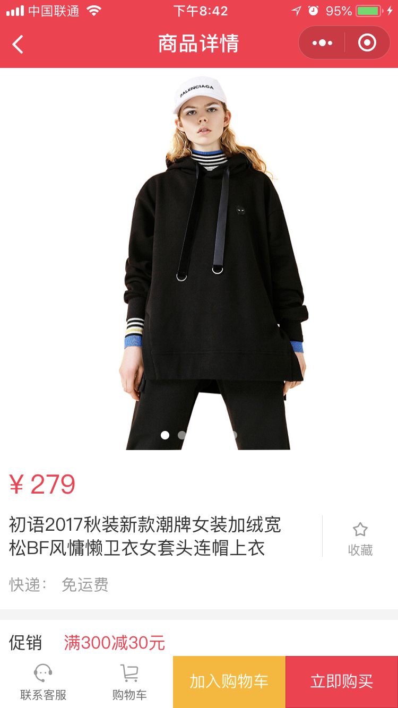

# 微信小程序学习第6天

## 每日反馈

1. 多讲一点uniapp 还有vuex
2. 老师讲讲 v-model,vuex,面向对象的理解?,父子组件传值,兄弟组件传值, 嘻,嘻嘻嘻


## Fiddler解决跨域问题

1. 接口请求拦截，替换成本地的.json文件
   1. 我们测试接口用的axios({})这个代码，上线依然是有效的
2. 文件请求拦截，替换成本地的文件，通常是js
   1. 如何在本地写代码，调用服务器的接口
   2. chrome network disabled cache, 可以每次请求新的文件
   3. 本地开发好了，再推送到线上
   4. 本地调线上接口会跨域
   5. fiddler代理线上文件到本地
   6. 不存在安全性问题


## 前端性能优化

1. 适当减少HTTP请求
   1. css/js合并打包
   2. 小图标用iconfont或者base64
   3. 雪碧图可维护性不好
2. 减少静态资源的体积
   1. js,css,图片压缩，图片压缩用tinypng.com
   2. 先经过tinypng压缩
3. 服务器端开启gzip
4. 预加载
   1. 利用浏览器空闲时间加载资源
5. 静态资源放CDN
6. 请求缓存，查询缓存
7. 设置合适的HTTP缓存
   1. 请求带宽
   2. 请求速度
8. 其他
   1. 减少dom数量（小程序，weex, RN）
   2. css预处理器，减少层级,小于3~4层
   3. 图片懒加载，Vue-lazyload
   4. 图片设置宽高，alt
      1. 重排
   5. 默认图片设置
   6. 接口请求的容错

面试要举实际的例子

1. [路由懒加载](https://router.vuejs.org/zh/guide/advanced/lazy-loading.html#%E6%8A%8A%E7%BB%84%E4%BB%B6%E6%8C%89%E7%BB%84%E5%88%86%E5%9D%97)
   1. 首屏加载速度增快


## React和Vue对比

[传送门](https://juejin.im/post/5dad09be518825393e52d1bd)

1. 语法

   1. vue单文件组件.vue格式，保留了html/css/js分离的写法，更接近常用的web开发方式，容易上手。
   2. react用jsx，html和css全写进js里面。学习使用起来有一定成本

2. 数据绑定

   1. vue是实现了双向数据绑定的mvvm框架，当视图改变更新模型层，当模型层改变更新视图层。在vue中，使用了双向绑定技术，就是View的变化能实时让Model发生变化，而Model的变化也能实时更新到View。

      Vue采用数据劫持&发布-订阅模式的方式，vue在创建vm的时候，会将数据配置在实例当中，然后通过Object.defineProperty对数据进行操作，为数据动态添加了getter与setter方法，当获取数据的时候会触发对应的getter方法，当设置数据的时候会触发对应的setter方法，从而进一步触发vm的watcher方法，然后数据更改，vm则会进一步触发视图更新操作。

      1. 大家去掘金看看如何实现简洁版本的vue

   2. react,大概是事件冒泡

3. 都有虚拟DOM

4. 指令, react没有for指令，需要用到map

5. 性能优化：React需要重写shouldComponentUpdate来避免不必要的dom操作 

   1. vue里面用this.$nextTick

6. App开发

   1. Weex基于Vue语法
   2. React Native基于React
      1. RN比weex更优秀


## 小程序生命周期钩子

#### 01.App生命周期

[传送门](https://developers.weixin.qq.com/miniprogram/dev/reference/api/App.html)

1. App在初始化，切前台后台时会以回调函数的形式通知我们

   | 钩子函数 | 说明                             |
   | -------- | -------------------------------- |
   | onLaunch | 小程序初始化时触发（只触发一次） |
   | onShow   | 从后台进入前台                   |
   | onHide   | 从前台进入后台                   |


#### 02.Page生命周期

[Page生命周期](https://developers.weixin.qq.com/miniprogram/dev/framework/app-service/page-life-cycle.html)

Page在加载、显示、渲染完成、隐藏和销毁时会以回调函数的形式通知我们

| 钩子函数 | 说明             | 备注 |
| -------- | ---------------- | ---- |
| onLoad   | 页面加载         |      |
| onShow   | 页面显示         |      |
| onReady  | 页面初次渲染完成 |      |
| onHide   | 页面隐藏         |      |
| onUnload | 页面销毁         |      |

> window.onload
>
> document.onDomContentLoaded

#### 03.页面栈的概念

[传送门](https://developers.weixin.qq.com/miniprogram/dev/framework/app-service/route.html)

在调试器的`AppData`查看当前活动页面，

使用 `getCurrentPages()` 函数获取当前页面栈 

| 路由方式   | 页面栈表现                      | 方法                        | 当前页面 | 后页面        |
| ---------- | ------------------------------- | --------------------------- | -------- | ------------- |
| 打开新页面 | 新页面入栈                      | wx.navigateTo               | onHide   | onLoad,onShow |
| 页面返回   | 页面不断出栈，直到目标返回页    | 左上角返回，wx.navigateBack | onUnload | onShow        |
| Tab切换    | 页面全部出栈，只留下新的Tab页面 | wx.switchTab                |          |               |

1. Tab栏只会初始化第一个页面，第一次切换到某tab时才会初始化该Tab; 后续切换tab只会显示/隐藏

2. 只有一个tab栏会入栈

   

#### 04.小程序和mpvue生命周期图

[小程序的生命周期](https://developers.weixin.qq.com/miniprogram/dev/framework/app-service/page-life-cycle.html)

[mpvue生命周期图示](http://mpvue.com/mpvue/#%E7%94%9F%E5%91%BD%E5%91%A8%E6%9C%9F%E5%9B%BE%E7%A4%BA)

1. 在小程序的第一页出现前，已经创建出了所有页面对应的Vue实例,并不是执行小程序页面的onLoad
2. `mpVue`中，一个`page`就是一个`Vue`实例，关闭页面会执行小程序页面的onUnload钩子，但是不会执行Vue实例的destory。
3. 再次进入page，vue实例的属性需要重置（bug）

#### 05.场景值

[传送门](https://developers.weixin.qq.com/miniprogram/dev/reference/scene-list.html)

概念：小程序的入口，不同入口都有的标识，这个就是场景值

一般用作**事件上报**

1. 页面被访问的次数PV
2. 页面被不同用户访问的次数UV
3. 事件上报针对某一按钮

获取场景值：onShow(){options. scene }


## 优购案例-搜索结果

#### 07. 搜索和过滤栏固定定位，不随着商品列表滚动

[onPageScroll](https://developers.weixin.qq.com/miniprogram/dev/reference/api/Page.html#onPageScroll-Object-object)

1. 上滑时，搜索和过滤栏不随商品列表滚动
   1. onPageScroll：isFixed=true
2. 下拉刷新顶部loading
   1. onPullDownRefresh：isFixed:false

#### 08.无须在页面渲染的变量不要声明在data里面

1. pageNum
2. isRequest

#### 09.自测

1. 输入框输入关键字，商品列表展示第一页搜索商品
2. 下拉刷新，商品列表展示第一页搜索商品
3. 上拉加载，加载下一页商品
4. 分类页点击三级分类，输入框显示对应的三级分类的名称，商品列表展示第一页搜索数据


#### 10.提取公共样式

less变量的作用域是单文件内的

 一般提取全局less文件


## git stash使用

保存当前的工作进度，暂存区和工作区的改动保存起来

```bash
git stash -u  //有新文件加-u
git stash pop //恢复工作区
```

> 如果当前分支有改动，尽量不要切到另外的分支上


### 字体图标

[阿里矢量图标库](https://www.iconfont.cn/)

使用方法：

1. 搜索图标
2. 添加图标到购物车
3. 购物车里面添加进项目
4. 项目里生成在线代码

注意点

1. mpvue里面不支持网络路径样式引入


## 分享功能

[传送门](https://developers.weixin.qq.com/miniprogram/dev/framework/open-ability/share.html)

[onShareAppMessage](https://developers.weixin.qq.com/miniprogram/dev/reference/api/Page.html#onShareAppMessage-Object-object)

分享当前页面

1. 添加一个组件button，设置属性open-type="share"
2. 用户点击按钮后触发 `Page.onShareAppMessage` 事件
3. onShareAppMessage的参数可以定制分享的弹窗内容
   1. title 标题，默认为当前小程序的名称
   2. imageUrl 图片，默认是一张随机图片
   3. path 转发路径（别人点你的分享链接，跳转的页面路径），默认截图


## 联系客服

[传送门](https://developers.weixin.qq.com/miniprogram/dev/framework/open-ability/customer-message/customer-message.html)

1. 添加一个组件button，设置属性open-type="contact"

   

## 优购案例-商品详情页



#### 01.案例分析

1. 搜索列表的商品，点击可进入商品详情
2. 商品详情展示轮播图，可点击放大查看
3. 商品详情展示商品价格，名称，规格，送货地址及图文说明
4. 联系客服，加入购物车，或者直接购买。

#### 02.静态页面

1. 新建页面item
2. 商品详情页&搜索页跳转商品详情
3. 轮播图
4. 商品信息
5. 使用字体图标
6. 促销区域
7. 图文介绍与商品参数头部
8. 图文介绍与商品参数头部切换逻辑
9. 固定底部

#### 03.获取数据&渲染数据

1. 获取数据

   1. 搜索页点击商品跳转商品详情，传入id
   2. 根据接口请求商品详情
      1. 接口 `/api/public/v1/goods/detail?goods_id=${id}`

2. 渲染数据

   1. 轮播图

   2. 预览图片

      点击轮播图其中一张图片，会打开页面预览被点击图片，左右滑动可以预览其他图片

      1. 给轮播图片设置点击事件
      2. 调用wx.previewImage在新页面中全屏预览图片
         1. current当前显示图片的链接
         2. urls需要预览的图片链接列表
      3. 传入相应的参数

   3. 动态渲染商品价格和名称

   4. 渲染商品详情图文说明

      1. v-html支持图片渲染

   5. 分享功能

      1. 添加一个组件button，设置属性open-type="share"
      2. onShareAppMessage方法中设置标题
      3. 解决样式问题
         1. 定位
         2. 隐藏

   6. 联系客服功能

      1. 添加一个组件button，设置属性open-type="contact"
      2. 解决样式问题
         1. 定位
         2. 隐藏

      
   