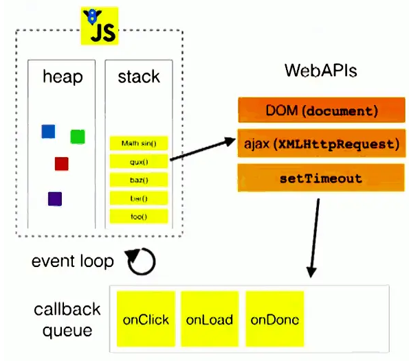

# 微信小程序学习第8天

## 每日反馈

1. 老师讲讲 v-model,vuex,面向对象的理解?,父子组件传值,兄弟组件传值, 嘻,嘻嘻嘻
2.  还有两个面试的问题： Vue异步更新队列大概是怎样做到的，属于宏任务微任务的哪部分 还有一个就是封装继承多态，大概指哪方面，如果能举个小案例就更好啦！

#### 01.Vue异步更新队列

[传送门](https://cn.vuejs.org/v2/guide/reactivity.html#%E5%BC%82%E6%AD%A5%E6%9B%B4%E6%96%B0%E9%98%9F%E5%88%97)

1. vue在更新DOM时是异步的
   1. 批量处理数据的变更到DOM更新
2. 内部实现尝试用`Promise.then`, 如果没有用 `setTimeout(fn,0)`
3. Promise是微任务，setTimeout是宏任务

#### 02.js的事件循环(Event Loop)



1. 所有同步任务都在主线程上执行，形成一个执行栈

2. 主线程之外，还存在一个任务队列。**只要异步操作执行完成**，就到任务队列中排队

3. 一旦执行栈中的所有同步任务执行完毕，系统就会依次读取任务队列的异步任务，**挑取一个宏任务执行**，于是被读取的异步任务结束等待状态，进入执行栈，开始执行

4. 主线程不断重复上面的的第三步
5. 宏任务与微任务
   1. 优先执行完所有的微任务
   2. 再执行一条宏任务


## 优购案例-购物车


#### 01.页面分析

1. 商品详情点购物车，或者tabBar点购物车去到购物车页面
2. 去掉收货地址选择，一般收货地址放在支付页面
3. 页面显示用户添加进购物车的商品列表，用户可选择商品，修改商品数量
   1. 实际项目一般购物车数据增删改查直接发请求
   2. 购物车数据存在storage要存
4. 点结算去到支付页面
5. 购物车里面并不是所有商品都会结算，可以选择是否进行结算
6. 生成订单，不管有没有支付成功，参加结算的商品应该从购物车去掉

#### 02.静态页面

1. 标题设置
2. 购物车信息头部
3. 购物车信息列表
4. 底部信息

#### 03.基本逻辑

1. 商品详情点购物车跳转到购物车页面

   1. 事件@click:toCart

   2. 切换到tab页wx.switchTab()

2. 商品详情页面，添加购物车，购物车数据存到storage,数据结构越简单越好，如下:

   1. 购物车的数据结构越简单越好，storage会比较小
   2. 购物车至少得有商品Id,商品的数量,商品有没有被选中
   3. 初次添加，商品数量为1,商品默认是勾选的
     4. 后续添加的，商品数量+1
     5. 取storage购物车，改数据，再存回去
     6. 如果购物车里面用户勾选了商品，商品详情添加购物车，这个商品就是勾选的
     7. 如果购物车里面用户去勾选了商品，商品详情添加购物车，这个商品就是勾选的

   ```js
   //声明成obj,取数据就方便
   cart = {
     商品id: {
       num: 商品数量, 
       checked:true
     }
   }
   
   //另外一种数据结构
   cart=[
       {
           商品Id，
           商品数量，
           是否选中
       }
   ]
   ```

   1. 判断是否是第一次添加
      1. 如果是数组的话，需要遍历
      2. 如果是对象的话，只需要判断对象上对应的属性是否存在

#### 04.请求数据&渲染数据

1. checkbox iconfont引入

2. 获取购物车数据

   1. 在onShow

3. 根据商品ids请求商品详情，方法getGoodsList

   1. 商品ids来自于storage购物车数据
   2. 如果购物车数据为空，不必请求
   3. 接口 `/api/public/v1/goods/goodslist?goods_ids=${ids}`

4. 商品数量修改

   1. 商品数量来自storage购物车
   2. -按钮最小值为1，1时disabled
   3. +按钮
   4. **合并数据, cart和goodsList**

5. 商品的选中状态切换

   1. 商详添加购物车时，默认checked:true
   2. 购物车商品选中状态和商品列表数据合并
   3. checkbox的选中状态:class

6. 全选逻辑

   1. 所有商品选中时，触发全选选中状态;所有商品不选中时，去勾选全选
      1.  **every()是对数组中每一项运行给定函数，如果该函数对每一项返回true,则返回true。**
      2.  **some()是对数组中每一项运行给定函数，如果该函数对任一项返回true，则返回true。** 
   2. 选中全选，所有商品选中;去勾选全选，所有商品不选中。

   >  // 如果所有商品都勾选的话，就true;详解：拿出goodsList.length==勾选商品的个数
   >
   >    // 默认true,遍历goodsList，如果有一项没勾选的话，就false
   >
   > forEach不能够break; for of是可以break

7. 总数量显示

   1. reduce的用法

      ```js
      arr.reduce(function(上一次计算后的值，当前遍历中的元素)){
          return 上一次计算后的值与当前遍历中的元素的运算
      }，初始值)
      ```

8. 总价显示

   1. 注意只有选中的商品才参与计算

9. 页面隐藏时onHide，保存cart状态到缓存


## 小程序授权

[授权](https://developers.weixin.qq.com/miniprogram/dev/framework/open-ability/authorize.html)

部分接口需要经过用户授权才能调用，比如说获取用户信息、通讯地址、微信运动步数等等

基本使用:

1. 先用getSetting获取用户授权的状态，如果拒绝的话，提示打开设置允许
2. 否则的话，使用`wx.authorize`发起授权，再调相应接口获取信息

授权行为：

1. 第一次发起授权某权限，会弹窗请求权限，用户同意后会调用接口
2. 如果用户已经授权，直接调用
3. 如果用户已经拒绝，直接进入失败。一般提示让用户允许，同时打开设置

注意点：

1. 用户信息的授权用`<button open-type="getUserInfo">用户信息</button>`, 即使用户拒绝也会弹出授权。

2. ```js
   <button open-type="getUserInfo" bindgetuserinfo="getuf">用户信息</button>
   ```

   

3. openSetting可以查看到各个授权的状态

4. getSetting也可以得到各个授权状态的数据


## 小程序登录

[传送门](https://developers.weixin.qq.com/miniprogram/dev/framework/open-ability/login.html)

第三方登录：第三方网站授权登录

步骤：

1. 获取用户信息, 如果没有授权过，会在底部弹出授权窗口的

   ```html
   <button open-type="getUserInfo"
               bindgetuserinfo="getuserinfo">点我登录</button>
   ```

2. wx.getCode()获取到

3. 调后端接口获取token


## 优购案例-登录

#### 01.页面分析

1. 购物车页面点结算，如果未登录，跳转登录，否则跳转支付页面
2. 登录页上，点立即登录，登录成功，存token, 并goBack

#### 02.基本逻辑

| getUserInfo | 获取用户信息，可以从bindgetuserinfo回调中获取到用户信息 |
| ----------- | ------------------------------------------------------- |
|             |                                                         |

1. 购物车点结算，当然如果没有选择商品就提示;未登录跳转登录; 否则跳转支付页面，
   1. 是否登录判断token
2. 登录页，立即登录
   1. getUserInfo+code，调登录接口
   2. 存储token并back

> 练习注意：
>
> 1. baseURL要更新了
> 2. 微信开发者账号，切换用户，截图让我扫码
> 3. 微信开发者工具appid换掉：wx38d8faffac4d34d2


## 优购案例-支付

#### 01.页面分析

1. 购物车点结算，或者商品详情点立即购买去到支付页面
2. 支付页面展示收货地址选择以及需要确定购买的商品列表（**不能去选中及修改数量, 没有勾选**）
3. 点击微信支付，生成订单，再微信支付
4. 支付成功或者失败进入订单结果页

#### 02.静态页面

1. 新建支付页面pay
2. 收货地址和选择收货地址
3. 收货地址边框
4. 商品列表copy，修改部分
5. 微信支付按钮，及订单信息也 

#### 03.基本逻辑

1. 购物车点结算跳转支付页面

   1. 商品数量不能为0
   2. 必须有token
   3. 满足条件才跳转支付页面

2. 点击请选择地址，选择微信地址，选择地址确定，获取地址，显示地址

   1. 微信，我->头像->我的地址，里面有微信的收货地址，这里同步微信的收货地址
   2. 点击请求选择地址@click="getAddress"
   3. 获取微信收货地址 wx.chooseAddress成功回调里获取

3. 获取到收货地址后，缓存到本地; 页面初始化时从缓存中读取

   

#### 04.请求数据&渲染数

1. 根据商品ids请求商品详情,**渲染购物车选中的商品**，方法getGoodsList

   1. 接口 `/api/public/v1/goods/goodslist?goods_ids=${ids}`

2. 点击微信支付先生成订单

   1. 判断是否有商品，是否选择了地址

   2. 接口/api/public/v1/my/orders/create

      1. method:POST

      2. 请求头 "Authorization" : token

      3. data:{

         order_price 订单价格

         consignee_addr 订单地址

         goods 商品列表内部存放商品对象（goods_id，goods_number和goods_price）}

      4. 不论成功或者失败，都从购物车里面清掉checked商品

3. 生成订单成功后，生成预支付交易单

   1. 接口/api/public/v1/my/orders/req_unifiedorder
      1. method:POST
      2. 请求头 "Authorization" : token
      3. 请求体:
         order_number : 订单号

4. 生成订单后，调用wx.requestPayment


## Vue-element-admin权限管理解析

[项目官方文档](https://panjiachen.github.io/vue-element-admin-site/zh/)

[权限管理详细说明](https://juejin.im/post/591aa14f570c35006961acac) 

1.  创建vue实例的时候将vue-router挂载，但这个时候vue-router挂载一些登录或者不用权限的公用的页面。 
    1. router/index.js中声明了无须权限路由，并初始化了路由
2.  当用户登录后，获取用role，将role和路由表每个页面的需要的权限作比较，生成最终用户可访问的路由表。 
    1. /permission.js
3.  调用router.addRoutes(store.getters.addRouters)添加用户可访问的路由。 
    1. /permission.js
4.  使用vuex管理路由表，根据vuex中可访问的路由渲染侧边栏组件。 
    1. layout/components/Sidebar/index.vue

修改权限的时候，发送请求时给带的参数是怎么定义的?

1. 就传roleid

## mpvue坑点

1. 新增页面需要重新npm run start
2. 嵌套v-for索引别名不要相同，双层嵌套v-for需要取不同索引别名
3. v-html指令大部分HMTL不能解析，能解析img标签
4. 过滤器无法使用
5. 指令不支持方法，常见的{{}}里面不支持方法
6. 指令里面不支持字符串的模板语法
7. mpvue的app.json最好用根路径，以`/`打头
8. v-model指令不支持checkbox
9. **页面销毁，对应的Vue实例还在，需要手动重置数据**
10. 父传子，子组件里面可以直接改props，且不会影响父值
11. 经常有源码目录和dist目录不同步的问题，需要手动删除wx/dist重启

