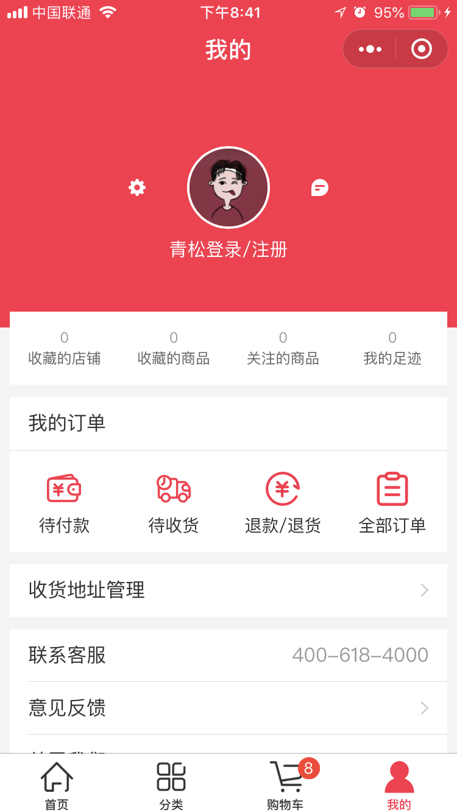

# 微信小程序学习第9天

## 每日反馈

1.  谢谢老师为我们答疑解惑 
2.  老师我想问一下微信公众号是怎么个形式,怎么制作~~ 


## 面向对象，封装继承多态

1. 面向对象是封装函数更高维高的封装，把方法和属性封装到一起。可以理解成二维和三维不一样。
2. 多态是同一行为对于不同对象不一样。Player1坦克和敌人坦克的move方法不一样。
3. 继承比如敌我坦克都有发射功能，可以封装一个坦克基类，那么敌我坦克就是继承自基类


## v-model与组件

[自定义组件的v-model](https://cn.vuejs.org/v2/guide/components-custom-events.html#%E8%87%AA%E5%AE%9A%E4%B9%89%E7%BB%84%E4%BB%B6%E7%9A%84-v-model)

v-model是语法糖，相当于：

```html
<input v-model="message" />
// 转换后：
<input
  v-bind:value="message"
  v-on:input="message=$event.target.value">
```

v-model与组件

1. 隐式添加 value 的 prop，子组件通过 props.value 接收值

2. 子组件通过 this.$emit('input')，改变父组件 v-model 绑定的值

3. v-model同样相当于语法糖

4. 在子组件里面可以定制value和input

   ```js
    model: {
       prop: 'info',
       event: 'update'
     },
   ```

   

   ```html
   <child v-model="msg"></child>
   // 转换后
   <child v-bind:value="msg"
         v-on:input="msg = arguments[0]"></child>
   ```


## 优购案例-优化

#### 02.商品详情-立即购买跳转支付页面

1. 传递goodsId
2. 展示立即购买的那个商品，数量为1
3.  无需存储到购物车

#### 03.设置购物车的商品个数

1. 购物车的onShow方法里面设置(无论商品是否选中，都算)
2. wx.setTabBarBadge
   1. index
   2. 显示文本，字符串类型
      1. 数量为选中**商品个数**

#### 04.request中设置token

1. isAuth为true是添加token

#### 05.request中status不为200时，错误提示


## 优购案例-订单结果页

#### 01.页面分析

1. 支付页面，支付取消或者支付成功，都会进入订单结果页

2. 订单结果页支付成功，展示成功状态和首页按钮，点首页按钮去到首页
3. 订单结果页支付失败，展示失败状态和首页按钮与订单详情按钮，点首页按钮去到首页，点订单详情去到订单详情

#### 02.静态页面

1. 文案及两个按钮

#### 03.基本逻辑

1. 支付页面上，支付成功和失败跳转订单结果页
   1. 失败时候传递orderNumber
2. 支付成功显示`首页`,并设置标题
3. 支付失败显示`首页`和`查询订单详情`，也设置标题


## 优购案例-订单详情

#### 01.页面分析

1. 订单结果点订单详情去到订单详情
2. 订单详情展示订单基本信息

#### 02.静态页面

1. 展示订单基本信息

#### 03.请求&渲染数据

1. 未登录跳转登录

2. 查询订单状态

   1. 接口 /api/public/v1/my/orders/chkOrder

      1. 请求方式POST

      2. 请求头:

         "Authorization" : token // 需要设置token带给后台

      3. 请求体:
         order_number : 订单号


## 优购案例-我的



#### 01.页面分析

1. 入口是tabBar
2. 展示登录状态收藏店铺、订单及其他信息
3. 已经登录展示用户头像和昵称，未登陆就显示登录，点登录跳转登录
4. 点订单跳转订单列表
5. 拨打电话的功能

#### 02.静态页面

#### 03.基本逻辑

1. 已经登录展示用户头像和昵称，未登陆就显示登录，点登录跳转登录
   1. login页userInfo添加到storage
   2. onShow里面获取到用户信息
   3. 点登录跳转登录
2. 拨打电话
   1. wx.makePhoneCall


## 优购案例-订单列表


#### 01.页面分析

1. 分别展示全部，待付款，已付款，退款/退货的订单列表
2. 在我的页面，点击订单去到订单列表
3. 点击订单列表其中一项，去到订单详情
4. 待支付的订单，点支付可以完成支付

#### 02.静态页面

1. 顶部tab栏
2. 订单列表展示

#### 03.基本逻辑

1. 我的页面点击不同菜单去到订单列表，选中对应的tab
   1. 两边菜单并不是一一对应的，设置数组序列标志
2. 点击tab展示对应的列表

#### 04.请求&渲染数据

2. 渲染订单列表

   1. 接口`/api/public/v1/my/orders/all?type=1`

      1. 请求方式GET

      2. 请求头:

         "Authorization" : token //需要设置token带给后台

2. 切换Tab发送请求


> 1. 购物车getGoodsList里面，如果传的ids是空的话，需要清空goodsList
> 2. todo:上拉加载和Tab组件的支持


## mpvue坑点

1. 新增页面需要重新npm run start
2. 嵌套v-for索引别名不要相同，双层嵌套v-for需要取不同索引别名
3. v-html指令大部分HMTL不能解析，能解析img标签
4. 过滤器无法使用
5. 指令不支持方法，常见的{{}}里面不支持方法
6. 指令里面不支持字符串的模板语法
7. mpvue tabBar的配置，app.json最好用根路径，以`/`打头。不要用相对路径
8. v-model指令不支持checkbox
9. **页面销毁，对应的Vue实例还在，需要手动重置数据**
10. 父传子，子组件里面可以直接改props，不会报错
11. 经常有源码目录和dist目录不同步的问题，需要手动删除wx/dist重启，更好的方式是在dev-server.js里面加上清空dist/wx目录的逻辑


## mpvue与Vuex的结合

vuex就是一个**全局变量**，存储整个所有组件的状态。

> 由于全局变量太灵活，vuex定义了一个操作全局变量的规范

核心概念：

1. state 状态
2. Getter是state的计算属性
3. Mutation改变state的方法


## mpvue中使用Vuex

1. `vue init mpvue/mpvue-quickstart mpvue-demo`
2. 安装过程中选择使用vuex
3. pages/counter里面就是vuex的基本使用


## 优购商城集成Vuex

主要思路：

小程序启动时，Vuex中购物车数据从storage里面读取，小程序隐藏时把购物车数据存到storage里面，在这之间购物车的一系列操作，只更改Vuex中购物车数据

#### 准备工作

1. 安装vuex

   ```
   npm install vuex
   ```

2. 新建文件`src/store/index.js`,并创建一个store

3. main.js中$store设置到Vue的原型上

4. 添加Vuex logger插件，方便打印日志

> 内存读取速度比较快，价格贵，断电不会保存
>
> 硬盘容量大，价格便宜，断电后会保存
>
> 读内存不会异步，读硬盘会异步

#### 页面逻辑重构

1. store里面购物车初始化
   1. store里面声明cart，并初始化从storage里面读取
2. 购物车页面
   1. 添加购物车
      1. 添加一个mutations add2Cart
      2. item页面commit
   2. 购物车商品列表展示
      1. store getters获取cart数据
   3. 购物车onHide时需要更新state.cart
      1. store中声明 updateCart
      2. 使用commit
3. App切后台，购物车数据存储到storage
   1. App.vue onHide方法触发
   2. commit storeCart方法
   3. storeCart方法里面存储state.cart到storage
4. 支付页面
   1. 展示商品列表
      1. getters.getCart
   2. 生成支付单后，删除购物车中勾选状态的商品
      1. mutations.arrangeCart


## 移动开发

| 开发方式          | 平台                                                         | 逻辑                 | 视图              | 用户体验   | 开发周期     |
| ----------------- | ------------------------------------------------------------ | -------------------- | ----------------- | ---------- | ------------ |
| 原生              | iOS: Object C、Swift<br />Android: Java、Kotlin              | 原生                 | 原生              | 好         | 长，审核太慢 |
| 移动Web(h5)       | 浏览器                                                       | js                   | HTML、css         | 无原生能力 | 短           |
| H5混合（hybrid）  | 移动web+原生壳，原生提供浏览器，可以加载网页，还有访问原生的能力 | js                   | HTML、css         | 一般       | 短           |
| 原生混合          | React Native与Weex(把js、html、css转成原生代码)              | js                   | 原生              | 稍好       | 较短         |
| Flutter(可能会火) | 原生                                                         | Dart（类js或者java） |                   |            |              |
| 小程序            |                                                              | JavaScript           | 小程序组件、css等 | 好         |              |


1. 原生
   1. 很少有纯原生的写的应用
   2. 除非对性能要求极高的。直播
   3. 主要是因为开发周期长，审核时间长
   4. 苹果一般两周，安卓需要小米商店，华为应用，应用宝
2. 移动Web
   1. 没有原生能力
   2. 大多数都作为一个引流的入口
3. H5混合（黑马头条App）
   1. 把移动网页打包到一个壳子中，安装到手机上去使用
   2. 性能和开发效率都不错，市场大部分用这种模式
   3. **一套代码安卓、ios和h5**
   4. 无须审核
4. 原生混合
   1. 语法稍有学习成本，只能兼容iOS和安卓
   2. 对性能要求稍好的项目会用
5. Flutter
   1. 内置渲染引擎
   2. 一次开发，多平台运行
6. 小程序
   1. 开发成本低，体验好
   2. 一般是App版的阉割版本，作为引流
