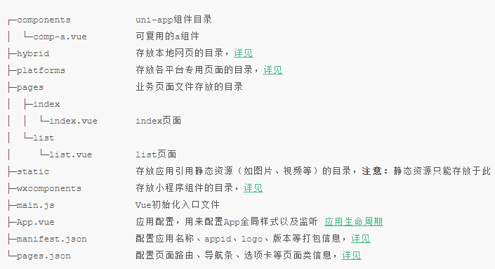
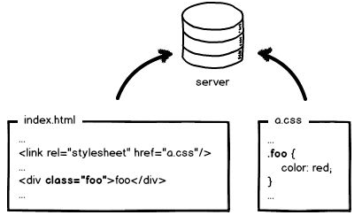
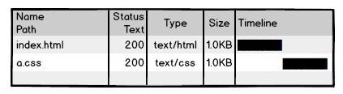
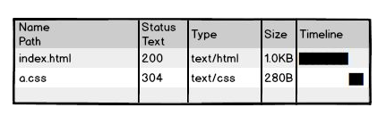
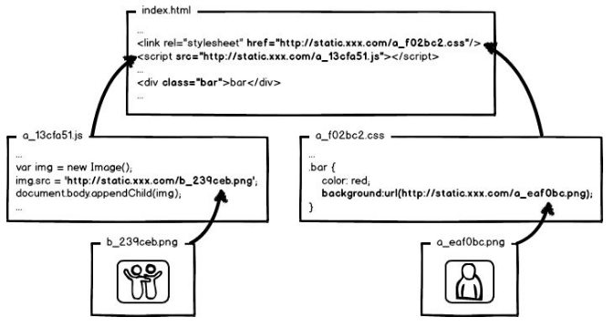
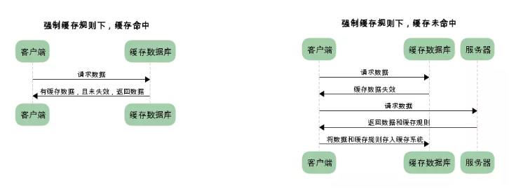
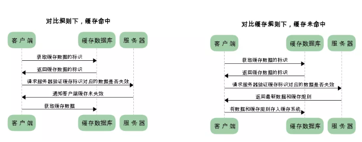
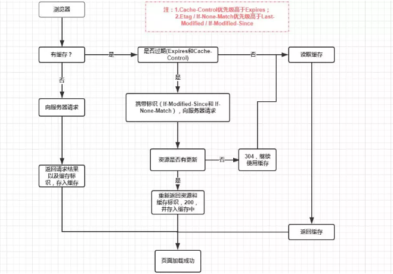

# 微信小程序学习第10天

##  权限管理

1. 用户看不到
   1. 展示允许用户看到的菜单
   2. 页面级别
   3. 页面元素级别的
2. 用户用不到
   1. 后端必须做权限验证
3. 用户是不变的，变的是角色
   1. 角色是多个权限的组合


## Vue-element-admin权限管理解析

[项目官方文档](https://panjiachen.github.io/vue-element-admin-site/zh/)

[权限管理详细说明](https://juejin.im/post/591aa14f570c35006961acac) 

1.  创建vue实例的时候将vue-router挂载，但这个时候vue-router挂载一些登录或者不用权限的公用的页面。 
    1. router/index.js中声明了无须权限路由，并初始化了路由
2.  当用户登录后，获取用role，将role和路由表每个页面的需要的权限作比较，生成最终用户可访问的路由表。 
    1. /permission.js
3.  调用router.addRoutes(store.getters.addRouters)添加用户可访问的路由。 
    1. /permission.js
4.  使用vuex管理路由表，根据vuex中可访问的路由渲染侧边栏组件。 
    1. layout/components/Sidebar/index.vue

#### 面试回答：

权限控制的主体思路，前端会有一份路由表，它表示了每一个路由可访问的权限。当用户登录之后，通过 **token** 获取用户的 **role** ，动态根据用户的 **role** 算出其对应有权限的路由，再通过`router.addRoutes`动态挂载路由。但这些控制都只是页面级的，说白了前端再怎么做权限控制都不是绝对安全的，后端的权限验证是逃不掉的。

> 项目npm install node-sass的问题，[参考传送门](https://blog.csdn.net/xdongll/article/details/75040808)

##  

## Dcould的产品

1. HBuilder X开发工具
2. uni-app一套代码支持多端的框架
3. wap2app 手机网页转App
4. H5+ 混合模式的App
5. MUI基于H5+的UI库

特点：

1. DCould公司的文档写得挺详细的，多看看可以更快点满前端技能点
2. 各个产品适合学习，做小型公司的产品

>Taro


## 开发工具HBuilder和HBuilderX

[传送门](https://www.dcloud.io/hbuilderx.html)

也是一款强大的前端IDE（绿色版），最好注册账号登录，**建议下载App开发版本**（支持打包apk）

1. 可以使用vscode的快捷键方案
2. 支持vue语法
3. 支持打包apk
4. 支持真机调试
5. 支持暗黑主题
6. 老王推荐
7. 。。。。

> 底层是eclipse

## HBuilder基本使用

新建`5+App`,选择Hello H5+模板

1. 浏览器运行
   1. 选中index.html，运行->选择浏览器

2. 真机调试
   1. 运行->选择手机
3. 打包apk

   1. 发行->云打包
   2. 勾选安卓，选择使用公有证书 
   3. 等待生成apk，下载安装即可


#### hbuilder连结手机：

1. 打开手机开发者选项->打开USB调试,连接后确认
2. 安卓：可能驱动不完善，先试着连结应用宝或者360手机肋手
3. ios需要安装itunes
4. [查看连结帮助](https://ask.dcloud.net.cn/article/97)

#### 注意点：

1. 建议调试用iOS
2. 安装App用安卓

> ios企业开发者账号，可以不通过AppStore审核使用。
>

#### 练习：

1. 安装apk到手机上
2. 创建hellomui,完成真机运行


## H5+基本使用

[传送门](https://ask.dcloud.net.cn/article/89)

开发H5混合模式的App，把一些常见的原生能力内置，令到JavaScript能调原生

1. 拨打电话

   ```js
   plus.device.dial(15361819220) 
   ```

   

2. 拍照

   ```js
   let camera = plus.camera.getCamera()
   camera.captureImage()
   ```

#### 注意点：

学习h5+ API, 让我们更加理解混合App


## uni-app介绍

[传送门](https://uniapp.dcloud.io/)

uni-app是一个使用vue.js开发“所有”前端应用的框架

1. 支持vue.js语法
2. iOS、Android、H5、以及各种小程序（微信/支付宝/百度/头条/QQ/钉钉）等多个平台 
3. 开发非企业级的应用没问题, 特别适合于学习。

**uni-app同样支持浏览器运行, app运行及打包成apk，微信开发者工具**


支持微信开发者工具打开

1. 选择微信开发者工具的位置
2. 工具->安全->开启

#### 提示：

1. uni-app有很多好的模板可以使用和参考(fuzhi)
2. 项目依赖的插件需要安装插件 工具->插件安装（less、sass）


## uni-app的工程结构

极像mpvue生成的工程结构



1. pages.json配置路由，导航条和Tab栏等，小程序app.json的页面管理部分
2. manifest.json包括app.json的非页面管理部分，还有App相关配置
3. 页面直接是.vue文件，页面的配置在pages.json里面

> 总的来说，工程结构和mpvue非常像，其实它也是nodejs+webpack的工程，只不过隐藏一些文件。


## uni-app的语法

[组件](https://uniapp.dcloud.io/component/README)

语法和mpvue非常类似

1. 组件和标签的变化
   1. div改成view，都行
   2. span改成text，都行
   3. a改成navigator，建议用navigator
   4. img改成image，都行
   5. select改成picker
   6. ul和li用view替代，能用, 不建议
   7. input,button能用
   8. 其他组件基本和小程序的一致

2. wx对象换成uni对象，但是wx依然能用
3. css的变化
   1. 使用rpx和px单位
   2. flex布局

#### 注意点：

1. uni-app可以使用自己的组件（组件和小程序组件很像），uni对象，可以用vue自身的语法
2. 如果按规范来写的话，兼容是最好的


## mpvue-yougou迁移到uni-app

[mpvue迁移uniapp](https://ask.dcloud.net.cn/article/34945)

#### 01.初步工作

1.  HBuilderX里新建**默认模板的uni-app**项目 `uni-yougou`
2.  src目录下的文件全部copy覆盖uni-yougou根目录
3.  在pages.json里面设置home页面的路径
    1. 工具-插件 安装less支持
4.  在pages.json里面设置home的标题，清除home路径下的main.json和main.js
5.  pages.json设置全局样式
6.  一些文件引入路径需要调整


注意点：

1. 建议用微信开发者工具调试或者内置浏览器

   1. 设置-安全设置-开启

2. 外部浏览器打开的url是本地server，跨域

3. 真机报错信息不充分

   

#### 02.显示四个tab页面

1. copy覆盖static目录到uni-yougou的根目录下

2. 在pages.json里面设置tabBar
3. 修改pages里面的页面路径，删除无用main.json和main.js

> '/'表示当前项目的根目录
>
> @也表示当项目的根目录
>
> H5有兼容性问题

 

#### 03.剩余工作

1. 建议页面下的文件名为main.vue，否则js里面路转路径得改。
   1. 为了只改配置不改代码
2. pages.json里面配置页面路径，修改对应页面index.vue为main.vue，删除main.json和main.js

注意：

1. 搜索列表页面配置上拉加载和下拉刷新


#### 04.bug修复

1. @click="不能在行内写逻辑"
   1. 分类，搜索列表，购物车+-和checkbox
2. 购物车ids为空报错
3. tabBarBadge的设置bug

> 微信开发者工具appid换掉：wx38d8faffac4d34d2


#### 05.发布

1. 真机运行，并打包apk，安装
2. 发行H5，并运行


## 大公司里怎样开发和部署前端代码？

[传送门]( https://www.zhihu.com/question/20790576/answer/32602154 )

1. 页面index.html包含a.css，无缓存
   1. 每次用户访问页面都要从服务器加载





2. a.css使用缓存器缓存，协商缓存，询问服务器缓存有没有过期

   1. 还是需要请求服务器一次

   

3. 静态资源内容变更都更新hash,从浏览器取缓存;入口文件协商缓存

   

> 1. 静态资源只要更新就会生成新的文件，使用时候，直接使用缓存


## HTTP缓存

概念： 浏览器请求某资源（html,js,css,图片等）时，如果浏览器有资源副本，就可以直接从浏览器缓存中获取，不用从服务器获取。
作用：节省流量，提高用户体验


#### 强制缓存

即浏览器直接使用缓存



1. 一般设置 cache-control里面的max-age为一个长时间，单位为秒
2. 一般静态资源都用强缓存


#### 协商缓存

浏览器缓存数据和数据的标识，下一次请求发送缓存标识给服务器，确定缓存数据有没有改动。如果没有改动，返回304，取缓存数据; 如果有改动，服务器发送请求的数据和新的标识。



1. 数据的标识有两种

   1. 修改时间 If-Modified-Since和Last-Modified

   2. Etag 根据文件内容或者摘要生成 If-None-Match和etag

      

#### 总结

1. 入口文件设置协商缓存

2. 静态资源设置强缓存，cache-control里面的max-age设置时间长一些。

3. 一般对HTTP缓存的设置是由运维或者后端来设置的，但是前端需要了解这些边界问题





## 小程序组件基本使用

[传送门](https://developers.weixin.qq.com/miniprogram/dev/framework/custom-component/)

声明组件，基本和页面没啥区别

1. 结构
2. 样式
3. 逻辑
   1. **方法写在methods里面**

使用组件

1. 引入

   1. // 组件名:组件路径

      ```json
      {
        "usingComponents": {
          "counter":"/components/counter"
        }
      }
      ```

2. 使用

   1. 当标签使用即可。

   

## 小程序组件父子组件通信

1. 父传子

   1. 在父组件中的子组件标签添加属性，给子组件传递数据 

      ```
       <submit-bar totalMoney="{{totalMoney}}" ></submit-bar>
      ```

   2. 子组件在js中通过properties接收，可以指定接收数据类型

      ```js
       properties: {
           totalMoney: Number
       }
      ```

2. 子传父

   1. 在父组件的子组件标签自定义事件，传给子组件

      ```html
       <submit-bar  bind:submit="submit" ></submit-bar>
      ```

   2. 子组件用`this.triggerEvent('父组件自定义事件', '要传递的参数')`，触发父组件传过来的自定义事件 

      ```
       this.triggerEvent("submit", 'Hello Grayly')
      ```

   3. 第二步执行后，父组件自定义事件绑定的函数就会执行，同时接受子组件传过来的数据
      （在event.detail中可得到子组件传过来的参数） 

      ```
      submit(event) {
      	console.log(event);
      },
      ```

      

## 小程序云开发简介

小程序的后端服务器，帮助开发者快速搭建后端服务。开发语言是Node.js

提供的功能：

1. 云函数
   1. 获取appid等鉴权信息
   2. 更容易完成登录和支付
2. 云数据库
   1. mangodb
   2. 数据的增删改查
3. 云存储
   1. 管理文件

特点：

1. 不管考虑服务器，运维，域名等等
2. 免费2GB数据库和5GB的文件存储
3. 开发简单

原理：SeverLess无服务

	1. 不太需要维护的,可扩展的服务

   	2. 让开发者只需要关注自己的业务逻辑就行


## 小程序云开发开通

1. 新建项目云开发
   1. 不能使用测试账号
2. 微信开发者工具上点击云开发，确定 
3. 新建环境
   1. 每个小程序账号可以免费创建两个环境，建议开发环境(测试环境)和生产环境
   2. 基础版是免费的，完全可以满足开发

4. 云开发控制台
   1. 运营分析
   2. 可以再创建一个环境

5. miniprogram是前端代码，cloudfunctions是云后台代码


## 云数据库

[传送门](https://developers.weixin.qq.com/miniprogram/dev/wxcloud/basis/capabilities.html#%E6%95%B0%E6%8D%AE%E5%BA%93)

​	云开发提供了一个JSON数据库（mongoDB），提供2GB免费存储空间。

集合里面每条记录都是一个JSON格式的对象，可以理解为一个JSON数组

使用方法：

1. 创建一个集合`user`，添加记录

   1. 导出，可以看到JSON数据集合

2. 插入一行

   1. 返回_id是唯一标识

   ```js
   db.collection('user').add({
       data: {
           name: 'Joven2',
           age: 28
       }
   }).then(res=>{
       console.log(res)
   })
   ```

3. 查找

   1. 查找某一行记录
   2. 查找多个记录

   ```js
   db.collection('user').doc('953037125dd725ef01fdb3fa34a391d0').get().then(res=>{
       console.log(res)
   })
   
   db.collection('user').where({
       name: 'Joven1'
   }).get().then(res=>{
       console.log(res)
   })
   ```

4. 更新一行

   1. doc后面指定是_id

   ```js
   updateRow(){
       db.collection('user').doc('953037125dd725ef01fdb3fa34a391d0').update({
           data:{
               age: 100
           }
       }).then(res=>{
           console.log(res)
       })
   },
   ```

5. 手动插入的数据没有_openid，权限的作用

6. 删除一行

   ```js
   db.collection('user').doc('953037125dd725ef01fdb3fa34a391d0').
       remove().then(res=>{
         console.log(res)
       })
   ```

> 给前端操作数据库的逻辑


## 云函数

小程序运行的后端代码。

1. 安装Nodejs环境

2. 新建云函数sum,在index.js

   ```js
   exports.main = async (event, context) => {
    return{
      sum:event.a+event.b
    }
   }
   ```

3. 在小程序前端的代码里面

   ```js
   wx.cloud.callFunction({
       name:'sum',
       data:{
           a:2,
           b:3
       }
   }).then(res=>{
       console.log(res.result.sum)
   })
   ```

4. 调用login，获取登录信息


## 云存储

免费5GB的存储空间

一般用于存储图片

```JS
wx.cloud.uploadFile({
    cloudPath:'example.png',
    filePath:tempFilePaths[0],
}).then(res=>{
    // console.log(res)
})
```

